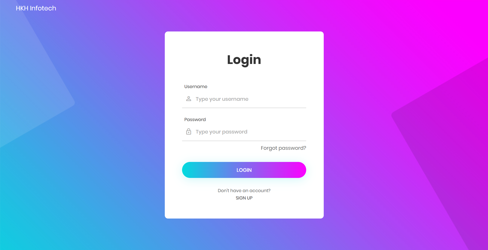
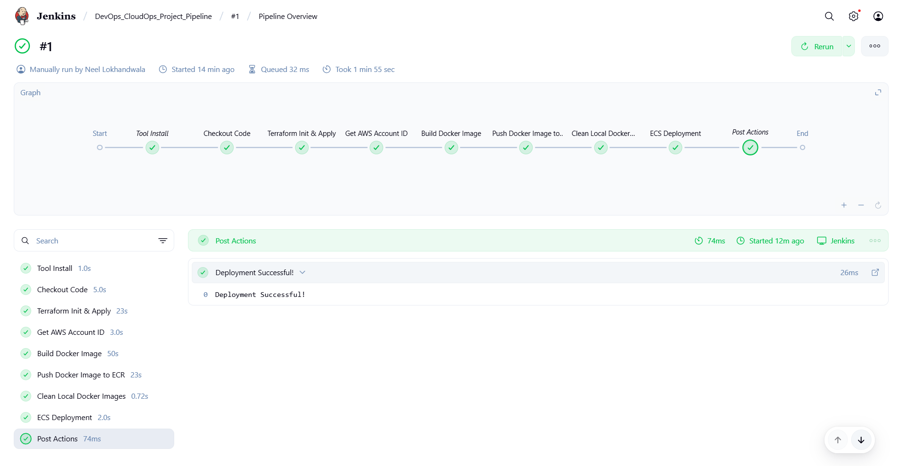
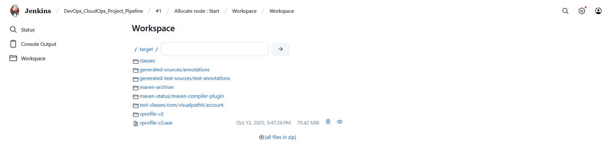
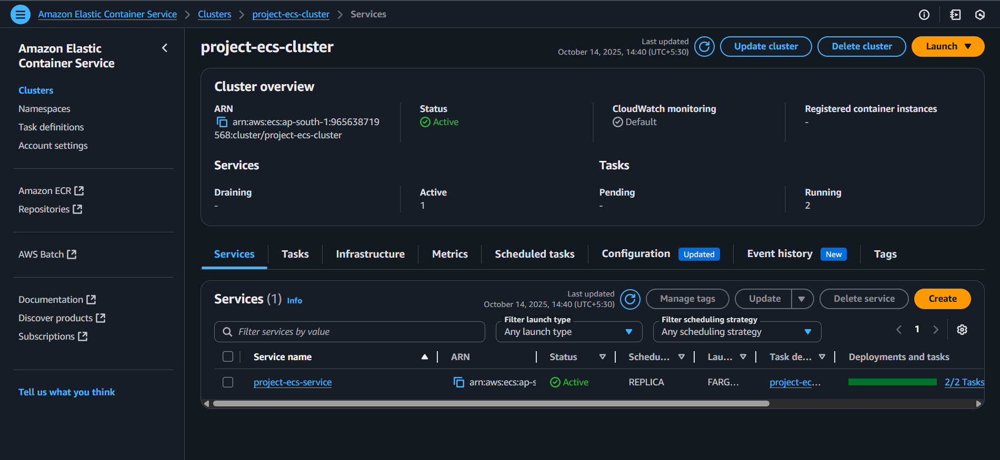
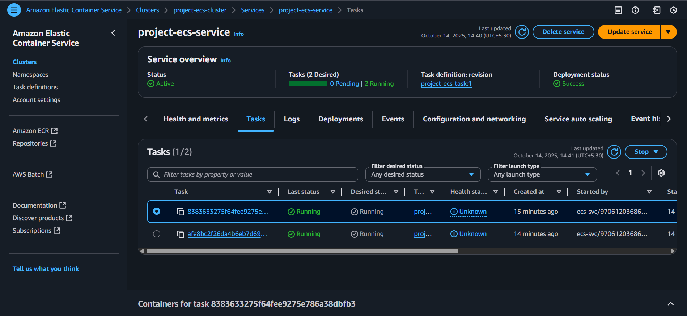
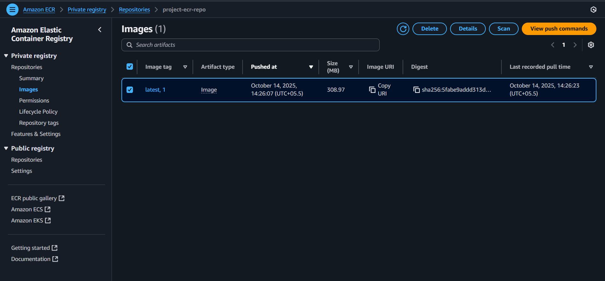
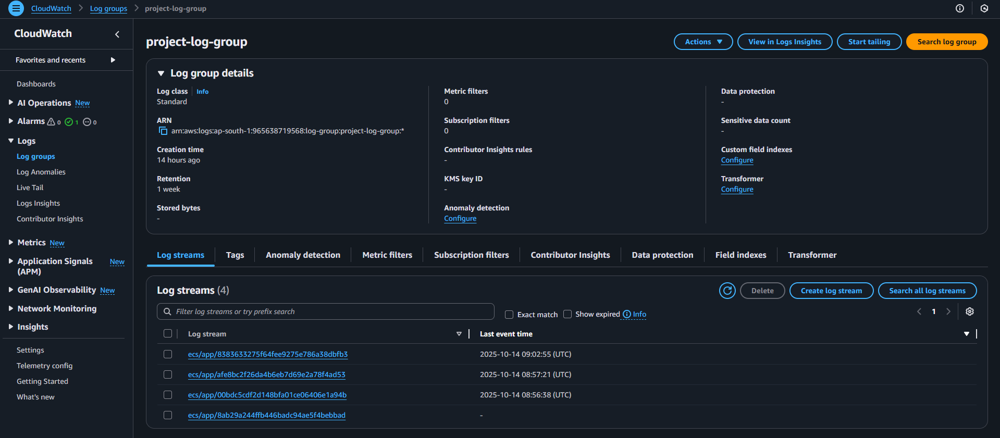

# DevOps-CloudOps Automated Project

## Table of Contents

- [Project Overview](#project-overview)
- [Problem Statement](#problem-statement)
- [Solution](#solution)
- [Tech Stack](#tech-stack)
- [Deployment Pipeline](#deployment-pipeline)
- [Screenshots & Outputs](#screenshots--outputs)
- [Real-world Applications](#real-world-applications)
- [Future Enhancements](#future-enhancements)
- [References](#references)

---

## Project Overview

This project demonstrates an end-to-end DevOps & CloudOps workflow for deploying a web application in a fully automated manner using:

- **Docker:** Containerizes the application.
- **Terraform:** Infrastructure as Code (IaC).
- **Jenkins:** CI/CD pipeline automation.
- **AWS ECS Fargate:** Serverless container orchestration.
- **AWS ECR:** Container registry.

The project takes a Java web application (from **VProfile**) and deploys it seamlessly to AWS ECS via Terraform and Jenkins automation.

---

## Problem Statement

Deploying applications manually in a cloud environment is:

- Time-consuming  
- Prone to human error  
- Difficult to reproduce across environments  

This project solves these problems by automating infrastructure provisioning, Docker image creation, deployment, and monitoring.

---

## Solution

The solution provides:

- **Automated Infrastructure** using Terraform (VPC, ECR, Security Groups, ECS Cluster, CloudWatch logs, IAM Roles)  
- **Automated Docker Builds & Deployment** via Jenkins pipeline  
- **Monitoring & Alerts** using CloudWatch metrics and alarms  
- **Versioned Container Images** in ECR with lifecycle policies  

All steps are triggered automatically in a Jenkins pipeline, ensuring **continuous delivery and deployment**.

---

## Tech Stack

- **Languages & Frameworks:** Java, Maven, Tomcat  
- **DevOps Tools:** Docker, Jenkins, Terraform  
- **Cloud Services:** AWS ECS, ECR, CloudWatch  
- **Version Control:** GitHub  

---

## Deployment Pipeline

1. **Code Checkout:** Pull the latest code from GitHub.  
2. **Terraform:** Initialize and apply infrastructure automatically.  
3. **Docker Build:** Build a WAR file and containerize it.  
4. **ECR Push:** Push Docker image to AWS ECR.  
5. **ECS Deployment:** Update ECS Fargate service with new image.  
6. **Monitoring:** CloudWatch alarms monitor CPU usage and notify if thresholds exceed.

---

## Screenshots & Outputs

- **Deployed Application on ECS**  
  
  
- **Jenkins Pipeline Success**  
  

- **Workspace War Created**  
  

- **ECS Cluster & Service & Tasks**  
  
  

- **Docker Image in ECR**  
  

- **CloudWatch Logs**  
  

---

## Real-world Applications

- Rapid deployment of internal company tools  
- Automating web app updates in production  
- Scalable microservices deployment using ECS Fargate  
- Version-controlled container deployment pipelines  

---

## Future Enhancements

- Integrate **HTTPS** via ACM & Application Load Balancer  
- Auto-scaling ECS tasks based on load  
- Integrate **Slack/email notifications** for build and deployment  
- Use **Blue-Green deployment strategy** for zero-downtime updates  

---

## References

- [VProfile Project](https://github.com/hkhcoder/vprofile-project)  
- [Terraform](https://www.terraform.io/)  
